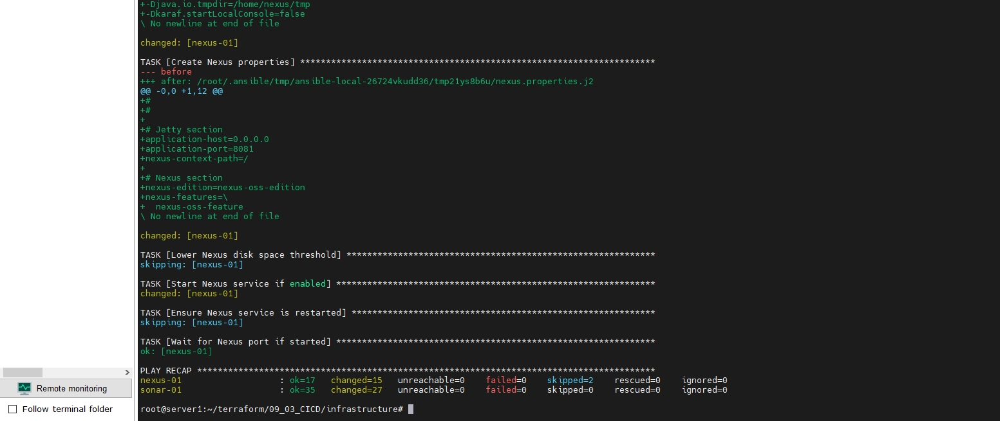
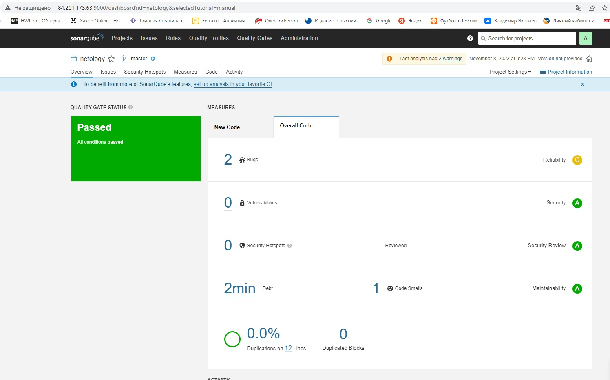
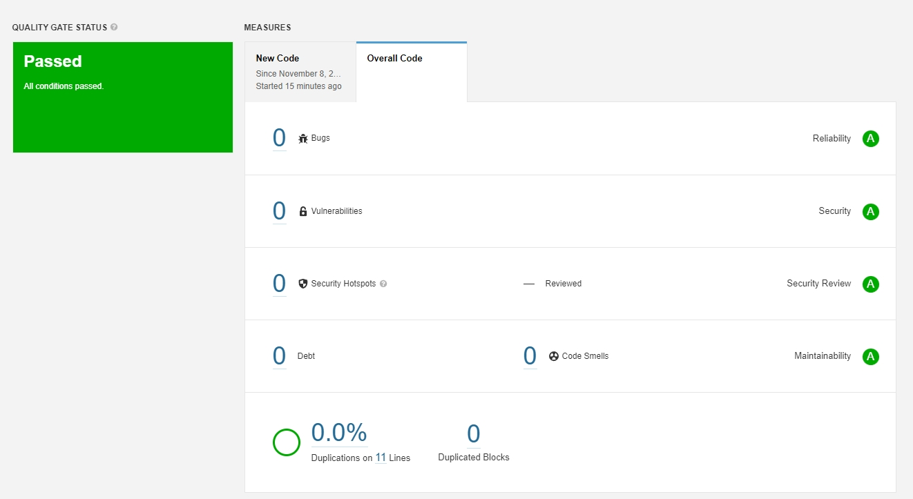
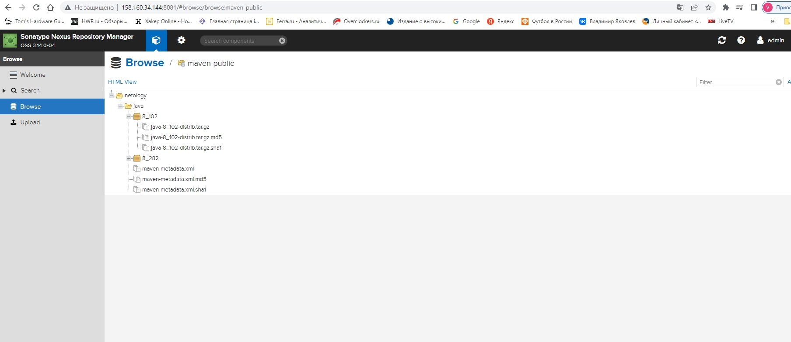

# Домашнее задание к занятию "09.03 CI\CD" dev-17_09-ci-03-cicd-yakovlev_vs
09-ci-03-cicd

## Подготовка к выполнению

1. Создаём 2 VM в yandex cloud со следующими параметрами: 2CPU 4RAM Centos7(остальное по минимальным требованиям)
2. Прописываем в [inventory](./infrastructure/inventory/cicd/hosts.yml) [playbook'a](./infrastructure/site.yml) созданные хосты
3. Добавляем в [files](./infrastructure/files/) файл со своим публичным ключом (id_rsa.pub). Если ключ называется иначе - найдите таску в плейбуке, которая использует id_rsa.pub имя и исправьте на своё
4. Запускаем playbook, ожидаем успешного завершения
5. Проверяем готовность Sonarqube через [браузер](http://localhost:9000)
6. Заходим под admin\admin, меняем пароль на свой
7.  Проверяем готовность Nexus через [бразуер](http://localhost:8081)
8. Подключаемся под admin\admin123, меняем пароль, сохраняем анонимный доступ

### - Выполнено




## Знакомоство с SonarQube

### Основная часть

1. Создаём новый проект, название произвольное
2. Скачиваем пакет sonar-scanner, который нам предлагает скачать сам sonarqube
3. Делаем так, чтобы binary был доступен через вызов в shell (или меняем переменную PATH или любой другой удобный вам способ)
4. Проверяем `sonar-scanner --version`
5. Запускаем анализатор против кода из директории [example](./example) с дополнительным ключом `-Dsonar.coverage.exclusions=fail.py`
6. Смотрим результат в интерфейсе
7. Исправляем ошибки, которые он выявил(включая warnings)
8. Запускаем анализатор повторно - проверяем, что QG пройдены успешно
9. Делаем скриншот успешного прохождения анализа, прикладываем к решению ДЗ

#### Решение

- Sonar-scanner установлен. Проверяем `sonar-scanner --version`

```bash
root@server1:~/terraform/09_03_CICD/sonar-scanner/bin# sonar-scanner --version
INFO: Scanner configuration file: /root/terraform/09_03_CICD/sonar-scanner/conf/sonar-scanner.properties
INFO: Project root configuration file: NONE
INFO: SonarScanner 4.7.0.2747
INFO: Java 11.0.14.1 Eclipse Adoptium (64-bit)
INFO: Linux 5.4.0-91-generic amd64
```
- Запускаем анализатор против кода из директории
```bash
root@server1:~/terraform/09_03_CICD/example# sonar-scanner \
>   -Dsonar.projectKey=netology \
>   -Dsonar.sources=. \
>   -Dsonar.host.url=http://84.201.173.63:9000 \
>   -Dsonar.login=fdd3b72363bd8af9bf0cad3859376978f39ccfb1 \
>   -Dsonar.coverage.exclusions=fail.py
INFO: Scanner configuration file: /root/terraform/09_03_CICD/sonar-scanner/conf/sonar-scanner.properties
INFO: Project root configuration file: NONE
INFO: SonarScanner 4.7.0.2747
INFO: Java 11.0.14.1 Eclipse Adoptium (64-bit)
INFO: Linux 5.4.0-91-generic amd64
INFO: User cache: /root/.sonar/cache
INFO: Scanner configuration file: /root/terraform/09_03_CICD/sonar-scanner/conf/sonar-scanner.properties
INFO: Project root configuration file: NONE
INFO: Analyzing on SonarQube server 9.1.0
INFO: Default locale: "en_US", source code encoding: "UTF-8" (analysis is platform dependent)
INFO: Load global settings
INFO: Load global settings (done) | time=154ms
INFO: Server id: 9CFC3560-AYRYQyzCXK6msUfPTvSo
INFO: User cache: /root/.sonar/cache
INFO: Load/download plugins
INFO: Load plugins index
INFO: Load plugins index (done) | time=74ms
INFO: Load/download plugins (done) | time=41952ms
INFO: Process project properties
INFO: Process project properties (done) | time=32ms
INFO: Execute project builders
INFO: Execute project builders (done) | time=2ms
INFO: Project key: netology
INFO: Base dir: /root/terraform/09_03_CICD/example
INFO: Working dir: /root/terraform/09_03_CICD/example/.scannerwork
INFO: Load project settings for component key: 'netology'
INFO: Load project settings for component key: 'netology' (done) | time=51ms
INFO: Load quality profiles
INFO: Load quality profiles (done) | time=212ms
INFO: Load active rules
INFO: Load active rules (done) | time=3964ms
WARN: SCM provider autodetection failed. Please use "sonar.scm.provider" to define SCM of your project, or disable the SCM Sensor in the project settings.
INFO: Indexing files...
INFO: Project configuration:
INFO:   Excluded sources for coverage: fail.py
INFO: 1 file indexed
INFO: Quality profile for py: Sonar way
INFO: ------------- Run sensors on module netology
INFO: Load metrics repository
INFO: Load metrics repository (done) | time=62ms
INFO: Sensor Python Sensor [python]
WARN: Your code is analyzed as compatible with python 2 and 3 by default. This will prevent the detection of issues specific to python 2 or python 3. You can get a more precise analysis by setting a python version in your configuration via the parameter "sonar.python.version"
INFO: Starting global symbols computation
INFO: 1 source file to be analyzed
INFO: Load project repositories
INFO: Load project repositories (done) | time=43ms
INFO: 1/1 source file has been analyzed
INFO: Starting rules execution
INFO: 1 source file to be analyzed
INFO: 1/1 source file has been analyzed
INFO: Sensor Python Sensor [python] (done) | time=1465ms
INFO: Sensor Cobertura Sensor for Python coverage [python]
INFO: Sensor Cobertura Sensor for Python coverage [python] (done) | time=11ms
INFO: Sensor PythonXUnitSensor [python]
INFO: Sensor PythonXUnitSensor [python] (done) | time=0ms
INFO: Sensor CSS Rules [cssfamily]
INFO: No CSS, PHP, HTML or VueJS files are found in the project. CSS analysis is skipped.
INFO: Sensor CSS Rules [cssfamily] (done) | time=1ms
INFO: Sensor JaCoCo XML Report Importer [jacoco]
INFO: 'sonar.coverage.jacoco.xmlReportPaths' is not defined. Using default locations: target/site/jacoco/jacoco.xml,target/site/jacoco-it/jacoco.xml,build/reports/jacoco/test/jacocoTestReport.xml
INFO: No report imported, no coverage information will be imported by JaCoCo XML Report Importer
INFO: Sensor JaCoCo XML Report Importer [jacoco] (done) | time=3ms
INFO: Sensor C# Project Type Information [csharp]
INFO: Sensor C# Project Type Information [csharp] (done) | time=4ms
INFO: Sensor C# Analysis Log [csharp]
INFO: Sensor C# Analysis Log [csharp] (done) | time=63ms
INFO: Sensor C# Properties [csharp]
INFO: Sensor C# Properties [csharp] (done) | time=1ms
INFO: Sensor JavaXmlSensor [java]
INFO: Sensor JavaXmlSensor [java] (done) | time=2ms
INFO: Sensor HTML [web]
INFO: Sensor HTML [web] (done) | time=2ms
INFO: Sensor VB.NET Project Type Information [vbnet]
INFO: Sensor VB.NET Project Type Information [vbnet] (done) | time=0ms
INFO: Sensor VB.NET Analysis Log [vbnet]
INFO: Sensor VB.NET Analysis Log [vbnet] (done) | time=23ms
INFO: Sensor VB.NET Properties [vbnet]
INFO: Sensor VB.NET Properties [vbnet] (done) | time=0ms
INFO: ------------- Run sensors on project
INFO: Sensor Zero Coverage Sensor
INFO: Sensor Zero Coverage Sensor (done) | time=1ms
INFO: SCM Publisher No SCM system was detected. You can use the 'sonar.scm.provider' property to explicitly specify it.
INFO: CPD Executor Calculating CPD for 1 file
INFO: CPD Executor CPD calculation finished (done) | time=16ms
INFO: Analysis report generated in 161ms, dir size=103.0 kB
INFO: Analysis report compressed in 18ms, zip size=14.1 kB
INFO: Analysis report uploaded in 74ms
INFO: ANALYSIS SUCCESSFUL, you can browse http://84.201.173.63:9000/dashboard?id=netology
INFO: Note that you will be able to access the updated dashboard once the server has processed the submitted analysis report
INFO: More about the report processing at http://84.201.173.63:9000/api/ce/task?id=AYRYeWHRXK6msUfPT0Xv
INFO: Analysis total time: 9.506 s
INFO: ------------------------------------------------------------------------
INFO: EXECUTION SUCCESS
INFO: ------------------------------------------------------------------------
INFO: Total time: 1:00.338s
INFO: Final Memory: 7M/49M
INFO: ------------------------------------------------------------------------
```
- Смотрим результат в интерфейсе



- Исправляем ошибки
```bash
root@server1:~/terraform/09_03_CICD/example# cat fail.py
def increment(index):
    index += 1
    return index
def get_square(numb):
    return numb*numb
def print_numb(numb):
    print("Number is {}".format(numb))

index = 0
while (index < 10):
    index = increment(index)
```
- Делаем скриншот успешного прохождения анализа




## Знакомство с Nexus

### Основная часть

1. В репозиторий `maven-releases` загружаем артефакт с GAV параметрами:
   1. groupId: netology
   2. artifactId: java
   3. version: 8_282
   4. classifier: distrib
   5. type: tar.gz
2. В него же загружаем такой же артефакт, но с version: 8_102
3. Проверяем, что все файлы загрузились успешно
4. В ответе присылаем файл `maven-metadata.xml` для этого артефекта

#### Решение 

- Проверяем, что все файлы загрузились успешно



- [maven-metadata.xml](https://github.com/Valdem88/dev-17_09-ci-03-cicd-yakovlev_vs/blob/main/maven-metadata/maven-metadata.xml)

### Знакомство с Maven

### Подготовка к выполнению

1. Скачиваем дистрибутив с [maven](https://maven.apache.org/download.cgi)
2. Разархивируем, делаем так, чтобы binary был доступен через вызов в shell (или меняем переменную PATH или любой другой удобный вам способ)
3. Удаляем из `apache-maven-<version>/conf/settings.xml` упоминание о правиле, отвергающем http соединение( раздел mirrors->id: my-repository-http-blocker)
4. Проверяем `mvn --version`
5. Забираем директорию [mvn](./mvn) с pom

- Готово 

```bash
root@server1:~/terraform/09_03_CICD/apache-maven/bin# mvn --version
Apache Maven 3.8.6 (84538c9988a25aec085021c365c560670ad80f63)
Maven home: /root/terraform/09_03_CICD/apache-maven
Java version: 1.8.0_342, vendor: Private Build, runtime: /usr/lib/jvm/java-8-openjdk-amd64/jre
Default locale: en_US, platform encoding: UTF-8
OS name: "linux", version: "5.4.0-91-generic", arch: "amd64", family: "unix"
```

### Основная часть

1. Меняем в `pom.xml` блок с зависимостями под наш артефакт из первого пункта задания для Nexus (java с версией 8_282)
2. Запускаем команду `mvn package` в директории с `pom.xml`, ожидаем успешного окончания
3. Проверяем директорию `~/.m2/repository/`, находим наш артефакт
4. В ответе присылаем исправленный файл `pom.xml`

#### Решение

```bash
...................
Downloading from central: https://repo.maven.apache.org/maven2/org/codehaus/plexus/plexus-interpolation/1.15/plexus-interpolation-1.15.jar
Downloading from central: https://repo.maven.apache.org/maven2/org/codehaus/plexus/plexus-archiver/2.1/plexus-archiver-2.1.jar
Downloading from central: https://repo.maven.apache.org/maven2/org/apache/maven/maven-archiver/2.5/maven-archiver-2.5.jar
Downloading from central: https://repo.maven.apache.org/maven2/org/codehaus/plexus/plexus-io/2.0.2/plexus-io-2.0.2.jar
Downloaded from central: https://repo.maven.apache.org/maven2/classworlds/classworlds/1.1-alpha-2/classworlds-1.1-alpha-2.jar (38 kB at 395 kB/s)
Downloading from central: https://repo.maven.apache.org/maven2/commons-lang/commons-lang/2.1/commons-lang-2.1.jar
Downloaded from central: https://repo.maven.apache.org/maven2/org/codehaus/plexus/plexus-interpolation/1.15/plexus-interpolation-1.15.jar (60 kB at 400 kB/s)
Downloading from central: https://repo.maven.apache.org/maven2/org/codehaus/plexus/plexus-utils/3.0/plexus-utils-3.0.jar
Downloaded from central: https://repo.maven.apache.org/maven2/org/codehaus/plexus/plexus-archiver/2.1/plexus-archiver-2.1.jar (184 kB at 1.2 MB/s)
Downloaded from central: https://repo.maven.apache.org/maven2/org/apache/maven/maven-archiver/2.5/maven-archiver-2.5.jar (22 kB at 130 kB/s)
Downloaded from central: https://repo.maven.apache.org/maven2/org/codehaus/plexus/plexus-io/2.0.2/plexus-io-2.0.2.jar (58 kB at 223 kB/s)
Downloaded from central: https://repo.maven.apache.org/maven2/commons-lang/commons-lang/2.1/commons-lang-2.1.jar (208 kB at 796 kB/s)
Downloaded from central: https://repo.maven.apache.org/maven2/org/codehaus/plexus/plexus-utils/3.0/plexus-utils-3.0.jar (226 kB at 516 kB/s)
[WARNING] JAR will be empty - no content was marked for inclusion!
[INFO] Building jar: /root/terraform/09_03_CICD/mvn/target/simple-app-1.0-SNAPSHOT.jar
[INFO] ------------------------------------------------------------------------
[INFO] BUILD SUCCESS
[INFO] ------------------------------------------------------------------------
[INFO] Total time:  20.848 s
[INFO] Finished at: 2022-11-08T20:36:27Z
[INFO] ------------------------------------------------------------------------
```
- Проверяем директорию `~/.m2/repository/`, находим наш артефакт

```bash
root@server1:~/.m2/repository/netology/java/8_282# ls -l
total 12
-rw-r--r-- 1 root root   0 Nov  8 20:36 java-8_282-distrib.tar.gz
-rw-r--r-- 1 root root  40 Nov  8 20:36 java-8_282-distrib.tar.gz.sha1
-rw-r--r-- 1 root root 392 Nov  8 20:36 java-8_282.pom.lastUpdated
-rw-r--r-- 1 root root 175 Nov  8 20:36 _remote.repositories
```

- [pom.xml](https://github.com/Valdem88/dev-17_09-ci-03-cicd-yakovlev_vs/blob/main/pom/pom.xml)

---

### Как оформить ДЗ?

Выполненное домашнее задание пришлите ссылкой на .md-файл в вашем репозитории.

---